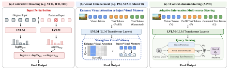

# Beyond Visual Enhancement: Adaptive Multi-Context Steering to Mitigate LVLM Hallucinations

<p align="center">
  <a href="https://arxiv.org/abs/2610.11907">
    
  </a>
  <a href="https://huggingface.co/datasets/VisionXLab/AIMS_Benchmarks">
    
  </a>
</p>

## 🔍 Overview

We find that LVLMs exhibit an intrinsic **vision-attending tendency**, which can serve as a reliable signal for adaptive visual steering. Beyond visual information, we further show that appropriately incorporating **prefilled textual context** and **generation history** at different decoding steps also contributes to hallucination mitigation.

Based on these observations, we propose **AIMS**, a training-free method that adaptively coordinates visual, prefilled, and generated context during decoding.

<p align="center">
  
</p>

## 🛠️ Environment

We use separate environments for the three LVLMs due to their different dependencies.

### LLaVA-1.5

```bash
conda create -n aims_llava python=3.10 -y
conda activate aims_llava
pip install -r requirements_llava.txt
```

Download [`liuhaotian/llava-v1.5-7b`](https://huggingface.co/liuhaotian/llava-v1.5-7b) from Hugging Face and set the local model path in `model_loader.py`.

### Qwen2.5-VL

```bash
conda create -n aims_qwen25vl python=3.10 -y
conda activate aims_qwen25vl
pip install -r requirements_qwen25vl.txt
```
Download [`Qwen/Qwen2.5-VL-3B-Instruct`](https://huggingface.co/Qwen/Qwen2.5-VL-3B-Instruct) from Hugging Face and set the local model path in the corresponding inference script.
### Qwen3.5

```bash
conda create -n aims_qwen35 python=3.10 -y
conda activate aims_qwen35
pip install -r requirements_qwen35.txt
```

Download [`Qwen/Qwen3.5-9B`](https://huggingface.co/Qwen/Qwen3.5-9B) from Hugging Face and set the local model path in the corresponding inference script.

## 📦 Data Preparation

The benchmarks used in our experiments are available on [Hugging Face](https://huggingface.co/datasets/VisionXLab/AIMS_Benchmarks).

## 🚀 Inference

### CHAIR

```bash
cd AIMS

bash scripts_chair/chair_llava15_aims.sh    # LLaVA-1.5
bash scripts_chair/chair_qwen25vl_aims.sh   # Qwen2.5-VL
bash scripts_chair/chair_qwen35_aims.sh     # Qwen3.5
```

### FaithScore

```bash
cd AIMS

bash scripts_faithscore/fs_qwen25vl.sh      # Qwen2.5-VL
```

### AMBER-G

```bash
cd AIMS

bash scripts_amber/amber_qwen25vl.sh        # Qwen2.5-VL
bash scripts_amber/amber_qwen35.sh          # Qwen3.5
```

### MME

```bash
pip install scikit-learn
cd AIMS

bash scripts_mme/mme_qwen25vl_aims.sh       # Qwen2.5-VL
bash scripts_mme/mme_qwen35_aims.sh         # Qwen3.5
```

## ⚙️ Key Arguments

### AIMS

| Argument | Description |
| --- | --- |
| `--use-qsteer-adaptive` | Enable AIMS during decoding. |
| `--start-layer` | First decoder layer to apply AIMS. |
| `--end-layer` | Last decoder layer to apply AIMS. |
| `--alpha` | Overall steering strength. |
| `--visual-branch` | Enable steering from visual context. |
| `--visual-sigma` | Temperature coefficient for the visual branch. |
| `--prefill-branch` | Enable steering from prefilled textual context. |
| `--prefill-sigma` | Temperature coefficient for the prefill branch. |
| `--decode-branch` | Enable steering from previously generated context. |
| `--decode-window` | Number of previous decoding tokens used by the generated-context branch. |
| `--decode-sigma` | Temperature coefficient for the generated-context branch. |

### Decoding

We support three decoding strategies:

- **Greedy decoding:** `--beam 1`
- **Beam search:** `--beam 5`
- **Nucleus sampling:** `--beam 1 --sample`

### Other Arguments

| Argument | Description |
| --- | --- |
| `--model-path` | Path to the LVLM checkpoint. |
| `--data-path` | Path to benchmark images. |
| `--bench-type` | Evaluation benchmark, e.g., `chair`. |
| `--exp-tag` | Optional tag for identifying the experiment. |
| `--debug-number` | Number of samples used for debugging. |

## 📊 Evaluation

Except for ```FaithScore```, all evaluation scripts can be run directly in the corresponding AIMS environment without creating a separate evaluation environment. FaithScore requires an additional environment due to its specific dependencies.

### CHAIR

The required NLTK 3.8.1 data can be downloaded from Hugging Face:

[`VisionXLab/AIMS_Benchmarks/nltk_3-8-1`](https://huggingface.co/datasets/VisionXLab/AIMS_Benchmarks/tree/main/nltk_3-8-1)

After downloading, set `NLTK_DATA` to the local path of `nltk_3-8-1` in `chair.py`:

```python
NLTK_DATA = "<path_to_nltk_3-8-1>"
```

Then run:

```bash
bash scripts/chair_score.sh
```

### FaithScore

For environment setup and evaluation scripts, please refer to [FAITHSCORE/README.md](FAITHSCORE/README.md).

### AMBER-G

The required NLTK 3.8.1 data can also be downloaded from Hugging Face:

[`VisionXLab/AIMS_Benchmarks/nltk_3-8-1`](https://huggingface.co/datasets/VisionXLab/AIMS_Benchmarks/tree/main/nltk_3-8-1)

After downloading, set `NLTK_DATA` to the local path of `nltk_3-8-1` in `AMBER/inference.py`:

```python
NLTK_DATA = "<path_to_nltk_3-8-1>"
```

Install the additional dependencies and run the evaluation:

```bash
cd AMBER

pip install spacy
python -m spacy download en_core_web_lg

bash scripts/run.sh
```

Alternatively, `en_core_web_lg` can be installed manually:

```bash
# Download:
# https://github.com/explosion/spacy-models/releases/download/en_core_web_lg-3.8.0/en_core_web_lg-3.8.0-py3-none-any.whl

python -m pip install en_core_web_lg-3.8.0-py3-none-any.whl
```

### MME

```bash
pip install scikit-learn
bash scripts/mme_score.sh
```

## 🙏 Acknowledgements

We sincerely thank the authors and contributors of the following projects and benchmarks:

- [FAITHSCORE](https://github.com/bcdnlp/FAITHSCORE)
- [AMBER](https://github.com/junyangwang0410/AMBER)
- [CHAIR](https://aclanthology.org/D18-1437/)
- [MME](https://github.com/BradyFU/Awesome-Multimodal-Large-Language-Models/tree/Evaluation)
- [Qwen](https://huggingface.co/Qwen)
- [LLaVA-1.5](https://huggingface.co/liuhaotian/llava-v1.5-7b)


## 📚 Citation

```bibtex
@misc{ma2026visualenhancementadaptivemulticontext,
  title={Beyond Visual Enhancement: Adaptive Multi-Context Steering to Mitigate LVLM Hallucinations}, 
  author={Shuran Ma and JiaLe Li and Yuxin Dong and Shan Zheng and Qingyun Jiang and Xiang Chen and Qi Zhu and Deyi Ji and Yifan Yang and Jianfeng Pan and Yu Tian and Xue Yang},
  year={2026},
  eprint={2610.11907},
  archivePrefix={arXiv},
  primaryClass={cs.CV},
  url={https://arxiv.org/abs/2610.11907}, 
}
```